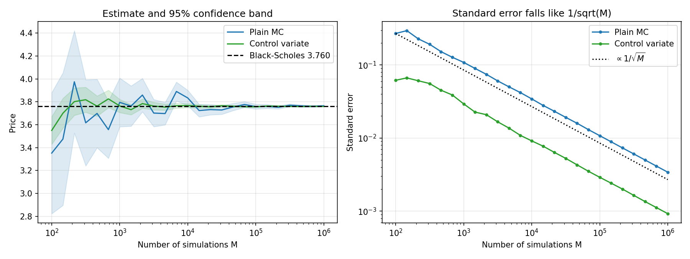
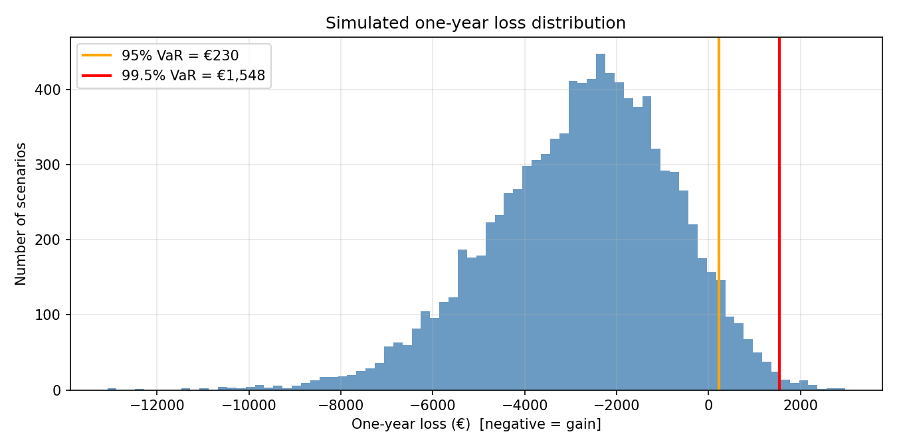

# Monte Carlo Simulation for Portfolio Risk and Option Pricing

Monte Carlo methods in Python for two problems that matter in banking and insurance:

1. **Portfolio risk.** One-year **Value at Risk (VaR)** and **Expected Shortfall** for a portfolio of six European insurers, including the **99.5% one-year level used to calibrate Solvency II capital**, with correlated returns simulated through a Cholesky decomposition.
2. **Option pricing.** Pricing a European call by risk-neutral simulation, validated against the **Black-Scholes** closed form, with **antithetic** and **control variate** variance reduction and a convergence study.

Everything is vectorised with NumPy and seeded, so the results are reproducible.

---

## Key results

### Option pricing (European call: S₀ = 101.15, K = 98.01, σ = 9.91%, r = 1%, T = 60 days, 100,000 simulations)

| Method | Price | Std. error | 95% CI | Variance reduction |
|---|---|---|---|---|
| Black-Scholes (exact) | **3.7600** | – | – | – |
| Plain Monte Carlo | 3.7494 | 0.0108 | [3.728, 3.771] | 1.0x |
| Antithetic variates | 3.7642 | 0.0041 | [3.756, 3.772] | **7.0x** |
| Control variate (on Sₜ) | 3.7628 | 0.0029 | [3.757, 3.769] | **13.4x** |

* Every Monte Carlo 95% interval contains the exact Black-Scholes price, which validates the simulation engine.
* The control variate gives the same accuracy as plain Monte Carlo with about **13x fewer simulations**. The payoff and the terminal price are correlated at 0.96, so the variance falls by a factor of 1 − ρ² ≈ 0.07.
* The market price of 3.86 implies a volatility of **10.76%**, against the 9.91% input, so the market was pricing in extra uncertainty.



### Portfolio risk (€10,000 equally weighted across Allianz, AXA, Munich Re, Generali, Hannover Re and Ageas; 1-year horizon; 10,000 paths; daily data 2023–2025)

| Confidence | VaR | Expected Shortfall |
|---|---|---|
| 95% | €230 (2.3% of portfolio) | €841 |
| 99.5% (Solvency II level) | €1,548 (15.5% of portfolio) | €1,987 |

* The 99.5% VaR is about **6.7x** the 95% figure, and the average loss in the worst 0.5% of scenarios is about €1,987.
* **Dependence matters.** With expected returns set to zero (to isolate correlation from the 2023-2025 rally), real correlation gives a 99.5% VaR of **€3,375** against **€1,909** if the stocks were independent, i.e. **1.8x larger**. Ignoring dependence would materially understate capital needs.
* **Note on the headline figures.** The table above uses the 2023-2025 sample mean returns, which reflect a strong insurer rally and flatter the VaR. The zero-drift figure (€3,375, about 34% of the portfolio) is the more conservative view of the same portfolio.



---

## Methods

| Topic | What the notebook does |
|---|---|
| Monte Carlo estimation | Sample mean, standard error σ/√M, 95% confidence intervals |
| Correlated simulation | Cholesky factor L of Σ, so μ + LZ ~ N(μ, Σ) |
| Risk measures | VaR (loss quantile) and Expected Shortfall (mean loss beyond VaR) at 95%, 99% and 99.5% |
| Dependence | Re-runs the simulation with zero correlation to measure the diversification effect |
| Asset model | Geometric Brownian Motion, solved exactly via Itô's lemma |
| Risk-neutral pricing | Price = e^(−rT) · E^Q[max(S_T − K, 0)] |
| Validation | Black-Scholes closed form and implied volatility (Brent root finding) |
| Variance reduction | Antithetic variates, control variates with optimal β = Cov(X, Y)/Var(Y) |
| Convergence | Price and standard error from 10² to 10⁶ simulations, compared with the 1/√M rate |

## Project structure

```
├── Monte_Carlo_Risk_and_Option_Pricing.ipynb   # main notebook (run top to bottom)
├── figures/                                    # charts saved by the notebook
├── requirements.txt
├── LICENSE
└── README.md
```

## How to run

```bash
git clone https://github.com/arakya/Monte-Carlo-Simulation-for-Option-Pricing.git
cd Monte-Carlo-Simulation-for-Option-Pricing
python -m venv .venv && source .venv/bin/activate   # Windows: .venv\Scripts\activate
pip install -r requirements.txt
jupyter notebook Monte_Carlo_Risk_and_Option_Pricing.ipynb
```

Prices are downloaded from Yahoo Finance via `yfinance`. If the download fails, the notebook switches to clearly labelled synthetic data so it still runs end to end.

## Limitations and next steps

* Returns are assumed normal. Real returns have **fat tails** and **volatility clustering**, so the true 99.5% loss is probably larger. Next step: Student-t or GARCH returns.
* Mean and covariance are fixed estimates from one three-year window. A next step is to **backtest VaR** against realised losses.
* Extensions: quasi-Monte Carlo (Sobol sequences), and path-dependent options (Asian, barrier) where no closed form exists.

## Acknowledgement

The starting point was the QuantPy tutorial *"Monte Carlo as a tool for Financial Math"*. This version rewrites and extends it with Black-Scholes validation, implied volatility, variance reduction, a convergence study, Solvency II style 99.5% VaR and a correlation analysis.

## Author

**Arakya Kaushik**, MSc Statistical Data Science, University College Dublin
[LinkedIn](https://www.linkedin.com/in/arakya-kaushik-5408a623a/) · [GitHub](https://github.com/arakya)
